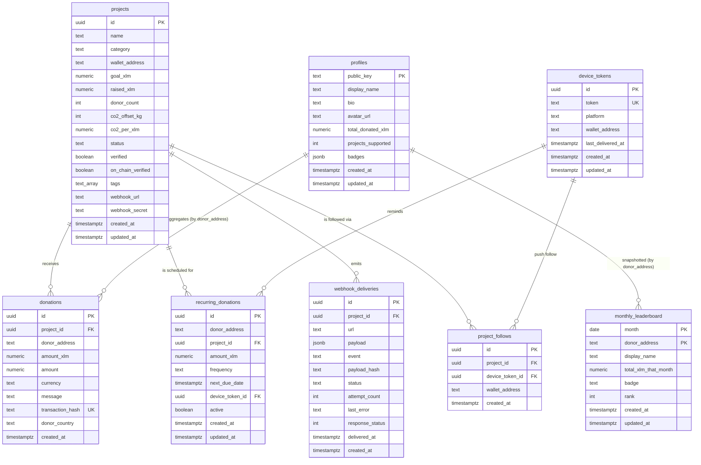

# Data Model

GreenPay stores everything in a single PostgreSQL 16 database. The schema is
created by the migrations in [`backend/src/db/migrations`](../backend/src/db/migrations);
[`backend/src/db/schema.sql`](../backend/src/db/schema.sql) is a consolidated
reference of the same tables. This document is the human-readable ERD and
column reference.

> **Source of truth:** the numbered migration files. When they disagree with
> `schema.sql`, the migrations win — see [Known caveats](#known-caveats).

## Entity relationship diagram

The `profiles` relationships are **logical**, keyed by wallet address
(`profiles.public_key` ↔ `donations.donor_address` /
`monthly_leaderboard.donor_address`). They are not enforced as foreign keys
because donations can arrive from wallets that have not created a profile yet.

## Core tables

### `projects`

The central registry. Every other project-scoped table references
`projects.id`.

| Column | Type | Notes |
| --- | --- | --- |
| `id` | `UUID` | Primary key |
| `name`, `description`, `category`, `location` | `TEXT` | Display metadata |
| `wallet_address` | `TEXT` | Stellar account that receives donations |
| `goal_xlm`, `raised_xlm` | `NUMERIC(20,7)` | Funding goal / running total |
| `donor_count`, `co2_offset_kg` | `INTEGER` | Summary counters updated by triggers |
| `co2_per_xlm` | `NUMERIC(20,7)` | Grams of CO₂ offset per XLM (migration `003_project_co2_per_xlm`) |
| `status` | `TEXT` | Lifecycle: `active` → `completed` / `cancelled` |
| `verified`, `on_chain_verified` | `BOOLEAN` | Off-chain review and Stellar anchor check |
| `tags` | `TEXT[]` | Free-form labels |
| `webhook_url`, `webhook_secret` | `TEXT` | Outbound webhook target and signing secret |
| `ai_summary*` | `TEXT` / `TIMESTAMPTZ` | Cached AI summary and provenance |
| `image_url`, `rejection_reason` | `TEXT` | Cover image and verification outcome |
| `created_at`, `updated_at` | `TIMESTAMPTZ` | Timestamps |

### `donations`

Immutable ledger — one row per Stellar payment. There is intentionally no
`updated_at`; rows are never mutated after insert.

| Column | Type | Notes |
| --- | --- | --- |
| `id` | `UUID` | Primary key |
| `project_id` | `UUID` | FK → `projects(id)` `ON DELETE CASCADE` |
| `donor_address` | `TEXT` | Stellar public key of the donor |
| `amount_xlm` | `NUMERIC(20,7)` | Legacy XLM amount (nullable) |
| `amount` | `NUMERIC(20,7)` | Amount in `currency` |
| `currency` | `TEXT` | Defaults to `XLM` |
| `message` | `TEXT` | Optional note |
| `transaction_hash` | `TEXT` | **UNIQUE** — one Stellar payment → one donation |
| `donor_country` | `TEXT` | Added by `003_add_donor_country_to_donations` |
| `created_at` | `TIMESTAMPTZ` | Insert time |

### `profiles`

Aggregated donor stats, keyed by Stellar wallet. `total_donated_xlm` and
`projects_supported` are counters kept in sync by triggers on `donations`;
`badges` is a JSONB array of earned badge IDs.

### `recurring_donations`

Monthly pledge schedules processed by the pg-boss daily job
(`recurringDonationQueue.js`). See [recurring-donations.md](./recurring-donations.md).

| Column | Type | Notes |
| --- | --- | --- |
| `id` | `UUID` | Primary key |
| `donor_address` | `TEXT` | Donor wallet |
| `project_id` | `UUID` | FK → `projects(id)` `ON DELETE CASCADE` |
| `amount_xlm` | `NUMERIC(20,7)` | Must be > 0 |
| `frequency` | `TEXT` | `weekly` / `monthly` / `yearly` |
| `next_due_date` | `TIMESTAMPTZ` | Polled by the recurring queue |
| `device_token_id` | `UUID` | FK → `device_tokens(id)` `ON DELETE SET NULL` |
| `active` | `BOOLEAN` | Pause/resume switch (partial index predicate) |

### `device_tokens` (tokens)

Push-notification device registrations. `token` is the FCM / APNs token and is
unique; `wallet_address` links a device to a profile when the user is
connected.

### `webhook_deliveries` (webhooks)

History of outbound webhook attempts, written when events such as
`milestone.reached` fire. Backs
`GET /api/webhooks/:projectId/history`. `status` is
`pending` / `delivered` / `failed`; retry bookkeeping lives in
`attempt_count`, `last_error`, `last_attempt_at`, `next_attempt_at`.
See [webhooks.md](./webhooks.md).

### `monthly_leaderboard` (leaderboard)

One snapshot row per `(month, donor_address)`. The composite primary key is
what makes the admin snapshot endpoint
(`POST /api/leaderboard/snapshot`) idempotent — re-running it for the same
month upserts instead of duplicating.

### `project_follows`

Join table backing project follows. Two shapes share the table:

- **Push follows** — `device_token_id` set, unique per `(project_id, device_token_id)`.
- **Wallet follows** — `device_token_id` NULL and `wallet_address` set, made
  unique by the partial index `project_follows_project_wallet_uidx`.

## Supporting tables

| Table | Purpose |
| --- | --- |
| `project_updates` | News / blog posts shown on the project page |
| `update_images` | Moderation audit log for update images (`update_images_status_check`) |
| `project_subscriptions` | Email subscriptions, unique per `(project_id, email)` |
| `jobs` | Freelance escrow jobs (Stellar escrow pattern) |
| `project_campaigns` | Time-boxed fundraising campaigns |
| `project_milestones` | Percentage funding milestones |
| `project_ratings` | 1–5 star ratings, unique per `(project_id, donor_address)` |
| `donation_matches` | Matching offers with `cap_xlm` and `multiplier` |
| `verification_requests` | Organisation applications for verification |
| `global_stats_mv` | Materialized landing-page totals, refreshed by pg-boss |
| `dead_letter` | Background jobs that exhausted all retries |

## Foreign keys and delete behaviour

| Child column | Parent | On delete |
| --- | --- | --- |
| `donations.project_id` | `projects.id` | `CASCADE` |
| `recurring_donations.project_id` | `projects.id` | `CASCADE` |
| `recurring_donations.device_token_id` | `device_tokens.id` | `SET NULL` |
| `webhook_deliveries.project_id` | `projects.id` | `CASCADE` |
| `project_follows.project_id` | `projects.id` | `CASCADE` |
| `project_follows.device_token_id` | `device_tokens.id` | `CASCADE` |
| `project_updates.project_id` | `projects.id` | `CASCADE` |
| `project_campaigns.project_id` | `projects.id` | `CASCADE` |
| `project_milestones.project_id` | `projects.id` | `CASCADE` |
| `project_ratings.project_id` | `projects.id` | `CASCADE` |
| `donation_matches.project_id` | `projects.id` | `CASCADE` |
| `project_subscriptions.project_id` | `projects.id` | `CASCADE` |
| `update_images.update_id` | `project_updates.id` | `CASCADE` (nullable) |
| `update_images.project_id` | `projects.id` | `CASCADE` (nullable) |
| `dead_letter` | — | no FK (job failures are global) |

## Key indexes

| Index | Table | Definition / purpose |
| --- | --- | --- |
| `idx_donations_donor_project` | `donations` | `(donor_address, project_id)` — "my donations to a project" |
| `idx_donations_project_created` | `donations` | `(project_id, created_at DESC)` — project activity feed |
| `idx_donations_composite`/`idx_donor_project` | `donations` | supporting donor queries (migration `003_add_donations_composite_index`) |
| `idx_profiles_donated` | `profiles` | `(total_donated_xlm DESC)` — leaderboard ordering |
| `idx_projects_status_donor` | `projects` | `(status, donor_count DESC)` — popular active projects |
| `recurring_donations_due_idx` | `recurring_donations` | `(next_due_date, status) WHERE status = 'active'` — queue poll |
| `recurring_donations_donor_idx` | `recurring_donations` | `(donor_address)` |
| `recurring_donations_project_idx` | `recurring_donations` | `(project_id)` |
| `idx_device_tokens_last_delivered` | `device_tokens` | `(last_delivered_at) WHERE last_delivered_at IS NULL` — cleanup |
| `idx_webhook_deliveries_status` | `webhook_deliveries` | retry worker scan |
| `idx_webhook_deliveries_project_created` | `webhook_deliveries` | `(project_id, created_at DESC)` — history endpoint |
| `idx_monthly_leaderboard_month_rank` | `monthly_leaderboard` | `(month DESC, rank ASC)` — history endpoint |
| `project_follows_project_wallet_uidx` | `project_follows` | unique `(project_id, wallet_address) WHERE device_token_id IS NULL` |
| `verification_requests_status_idx` | `verification_requests` | `(status, submitted_at DESC)` — admin review queue |
| `idx_update_images_pending_review` | `update_images` | `(created_at DESC) WHERE status = 'pending_review'` |
| `global_stats_mv_id_uidx` | `global_stats_mv` | unique on `id`, required for `REFRESH MATERIALIZED VIEW CONCURRENTLY` |

## Known caveats

- **Duplicate migration numbers.** Several migrations share a `002_`/`003_`
  prefix (for example `002_webhooks.js` and `002_verification_requests.js`).
  They do not conflict and are applied in filename order.
- **`recurring_donations` has divergent definitions.** `schema.sql` contains two
  `CREATE TABLE IF NOT EXISTS recurring_donations` blocks (one `frequency`-based,
  one `duration_months`-based) and `003_recurring_donations.js` adds a
  `device_token_id`/`active` shape. Because of `IF NOT EXISTS`, only the first
  definition to execute takes effect. The migration file
  (`003_recurring_donations.js`) is the applied source of truth; treat the
  duplicates in `schema.sql` as legacy.
- **`CONCURRENTLY` indexes.** Indexes created `CONCURRENTLY` cannot run inside a
  transaction, so failed migrations can leave a partially built index behind.
  See [contract-deployment.md](./contract-deployment.md#handling-a-failed-migration).

## Related files

- Migrations: [`backend/src/db/migrations`](../backend/src/db/migrations)
- Consolidated schema: [`backend/src/db/schema.sql`](../backend/src/db/schema.sql)
- Backup / restore: [database.md](./database.md)
